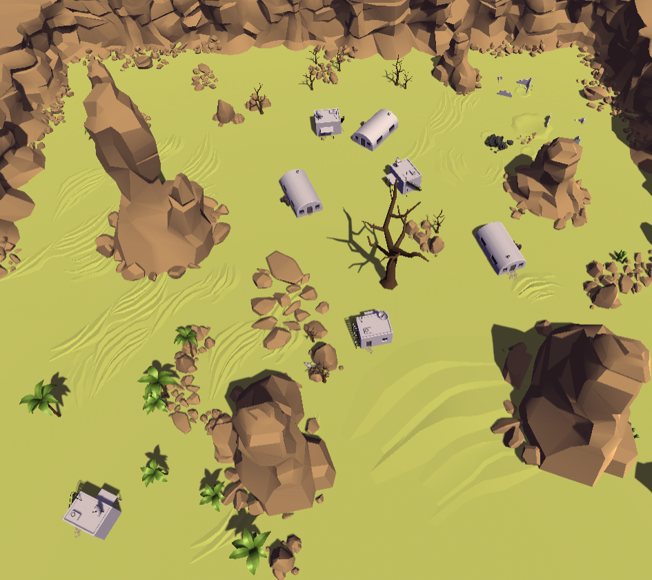

# Tanks Unity Game Extended!

## Deskripsi Aplikasi

**Tanks Unity Game Extended!** merupakan sebuah *Game Tanks* yang dibuat dengan [Unity](https://unity.com/). Permainan ini merupakan pengembangan dari Game [Tanks Tutorial!](https://learn.unity.com/project/tanks-tutorial), sehingga pada permainan kami terdapat beberapa fitur tambahan, seperti adanya *multiplayer* secara LAN, sistem peruangan, *bots*, senjata baru, *money rush mode*, dan lainnya.

## Cara Kerja Aplikasi

Project dapat dibuka dengan Unity Editor lalu di-build untuk menjadi *executable file*.

| Spesifikasi | Penjelasan |
| --- | --- |
| Multiplayer dapat dijalankan secara local area network dengan lebih dari dua pemain. Implementasi matchmaking (lobby) dibebaskan. | Multiplayer dengan *client authority* diimplementasikan dengan *library* Mirror, aplikasi mendukung sampai maksimal 4 pemain multiplayer dalam satu *match*. Lobby secara LAN diimplementasikan dengan 1 player menjadi *host* sekaligus *client* dan sisanya menjadi *client*. |
| Pada main menu, terdapat settings untuk mengatur intensitas suara dan nama pemain yang diimplementasi dengan PlayerPrefs. | Terdapat Main Menu yang bisa digunakan untuk mengatur nama dan suara sebelum *Join* atau *Host* suatu Lobby. |
| Desain pada map harus berbeda dari desain semula pada tutorial namun dapat menggunakan aset apapun. | Map baru adalah memodifikasi map semula dengan mengubah *properties*, *lighting*, dan *material* dari objek-objek pada map. |
| Terdapat objek cash yang muncul secara periodik. Tank dapat mengambil cash untuk menambahkan uang yang dimilikinya. | Objek *cash* muncul periodik secara *random* pada *map*, *cash* di representasikan dengan *gold coin* yang diperoleh dari *assets*, *gold coin* ini nantinya bisa digunakan untuk *weapon* atau *karakter*. |
| Terdapat minimal dua jenis senjata dengan karakteristik yang berbeda. Pemain dapat membeli senjata dengan menggunakan cash. | Terdapat dua jenis senjata baru, yakni *special weapon* dan *ultimate weapon*, masing-masing *weapon* tersebut merupakan pengembangan dari *weapon* biasa, namun memiliki bentuk yang berbeda serta karakteristik *power* yang berbeda, kemudian untuk menggunakan *weapon* ini perlu digunakan *cash*. |
| Terdapat minimal dua jenis karakter bergerak yang dapat dikeluarkan (tempat dibebaskan) dengan membayar cash, memiliki behavior yang berbeda, dan dapat diserang dengan peluru. | Terdapat 2 karakter yaitu **Robot** dan **Coin Drone**. **Robot** akan bergerak secara random dan mengikuti dan menembaki pemain lawan jika terdeteksi ada di sekitarnya. **Coin Drone** akan mengikuti pemain dan mengumpulkan cash yang terdeteksi ada di sekitarnya. Kedua karakter ini dapat diserang dengan peluru dan memiliki *Health* seperti pemain. |
| Animasi saat karakter bergerak melakukan aksi (contohnya jalan, tembak, dan diam) harus berbeda, namun dapat menggunakan aset apapun. | Animasi diimplementasikan menggunakan *Animator* dan aset-aset animasi yang tersedia, transisi animasi diatur melalui *script* masing-masing karakter. |
| Terdapat interaksi collision antara objek bergerak seperti tank dan karakter. | Tank dan karakter memiliki komponen *Collider* untuk memungkinkan terjadinya *collision*. |
| Aset tambahan yang digunakan dibebaskan namun perlu dituliskan pada credits. | *Scene Credit* terbuat terpisah yang akan menampilkan nama *developer* dan *Assets* yang kami gunakan, *scene* tersebut akan muncul ketika permainan sudah selesai. |
| Terdapat lebih dari satu map yang dapat dipilih oleh pemain. | Terdapat 2 buah map yang dapat dipilih oleh *host* dalam *match lobby*. |
| Terdapat lebih dari satu game mode selain battle royale. | Terdapat 2 buah *game mode* yang dapat dipilih oleh *host* dalam *match lobby*. *Game modes* yang dapat dipilih selain **Battle Royale** adalah **Money Rush** di mana tiap pemain beradu untuk mengumpulkan cash sebanyak-banyaknya dalam waktu 60 detik. |

## Library yang digunakan

Berikut adalah beberapa *library/assets* yang kami gunakan, beserta justifikasi pemakainnya:

- [Tanks Tutorial](https://assetstore.unity.com/packages/essentials/tutorial-projects/tanks-tutorial-46209) - Tentunya merupakan permainan orisinal yang akhirnya kami kembangkan, digunakan juga sebagai *starting point* dan referensi pembuatan  ekstensi permainan kami.
- [Gold Coins](https://assetstore.unity.com/packages/3d/props/gold-coins-1810) - Memiliki beberapa *FREE package coins* yang berguna untuk digunakan di permainan kami sebagai pengambilan uang, selain itu model *coins* cukup berkualitas.
- [Robot Soldier](https://assetstore.unity.com/packages/3d/characters/robots/robot-soldier-142438) - Asset ini gratis dan memiliki animasi robot berlari dan menembak, yang bisa kami gunakan sebagai karakter tambahan pada permainan kami dan nantinya kami kembangkan sendiri.
- [Melee Axe Pack](https://assetstore.unity.com/packages/3d/animations/melee-axe-pack-35320) - Asset ini gratis dan memiliki banyak animasi yang kompatibel dengan asset Robot Soldier.
- [Robot Sphere](https://assetstore.unity.com/packages/3d/characters/robots/robot-sphere-136226) - Asset ini gratis dan memiliki animasi robot yang sederhana, aset ini dapat kami gunakan sebagai karakter tambahan pada permainan kami dan nantinya kami kembangkan sendiri.
- [Mirror](https://assetstore.unity.com/packages/tools/network/mirror-129321) - Library untuk Multiplayer dengan LAN.

## Screenshot Aplikasi

### Main Lobby

### Map 1

### Map 2

### Pembagian Kerja

- Muhammad Hasan (13518012)
    - Membuat objek cash dari *Coin Assets*
    - Membuat script *coin periodic*
    - Membuat script *pickup coin*
    - Membuat senjata baru bernama *special weapon*
    - Membuat senjata baru bernama *ultimate weapon*
    - Membuat script untuk menggunakan senjata baru tersebut
    - Membuat *credits scene*
- Steve Bezalel Iman Gustaman (13518018)
    - Membuat sistem *Multiplayer* secara *local area network*
    - Membuat *main menu* yang berisikan settings
    - Membuat *Multiplayer Lobby*.
    - Membuat settings untuk mengatur intensitas suara dan nama pemain
    - Membuat beberapa desain map
    - Membuat *game mode* lain berupa *money rush*
    - Membuat karakter baru dari *Robot Soldier Assets*
    - Membuat script untuk karakter Robot
    - Membuat script untuk karakter Coin Drone
- Yan Arie Motinggo (13518129)
